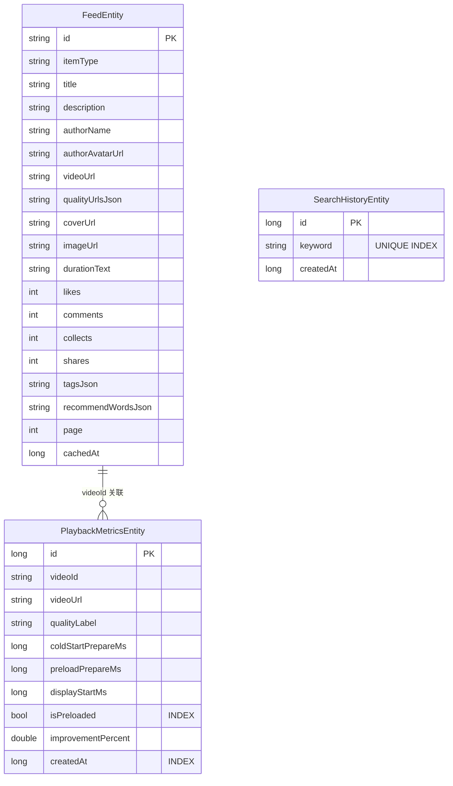
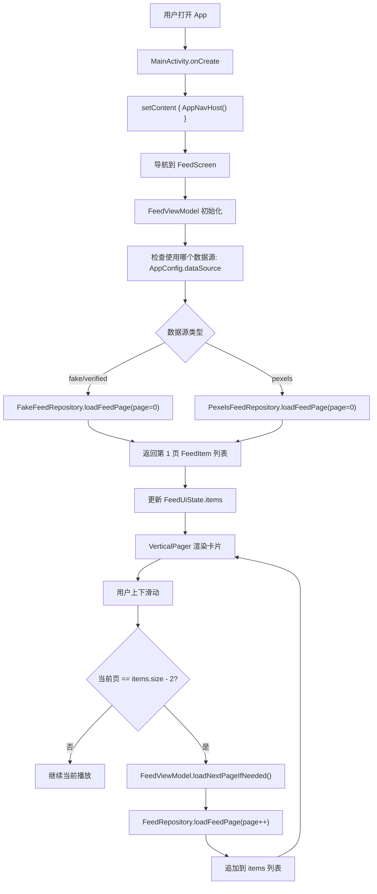
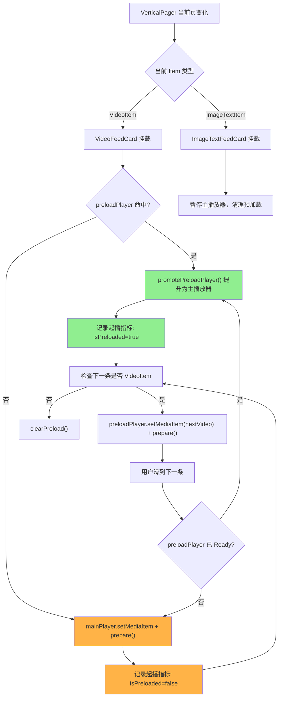
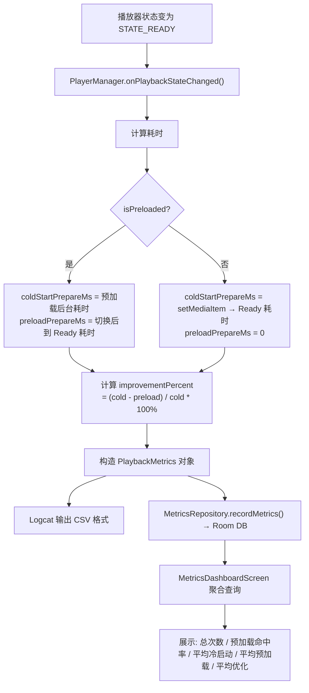
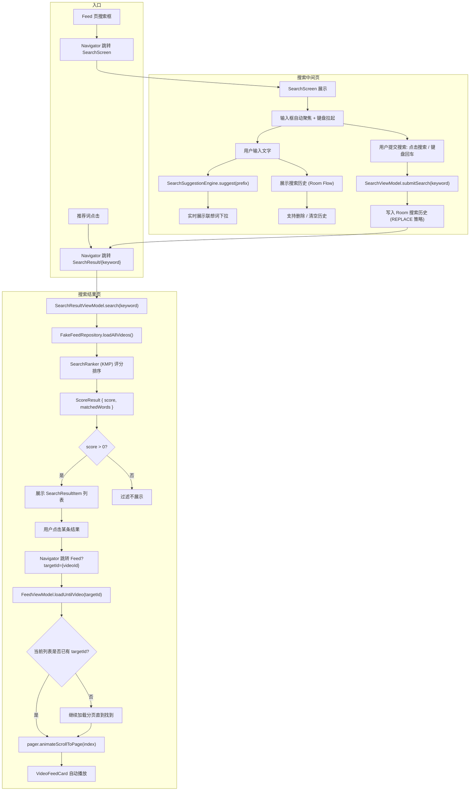
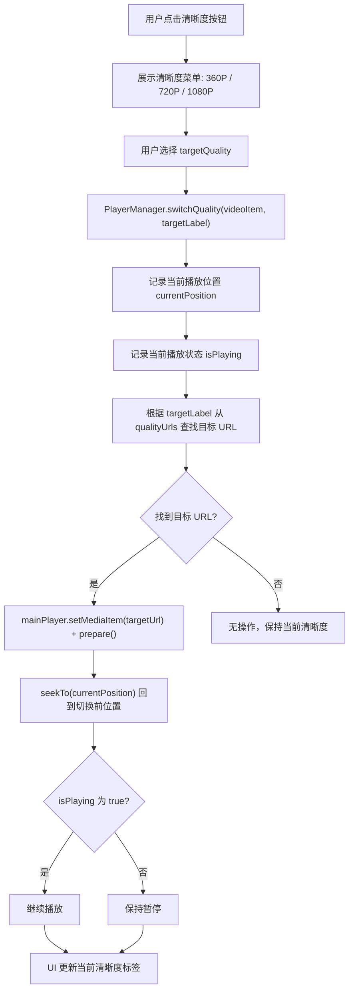
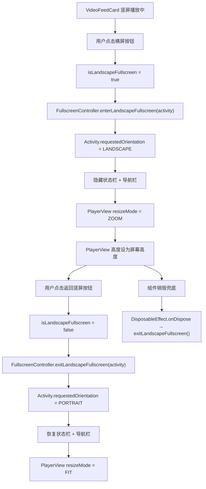
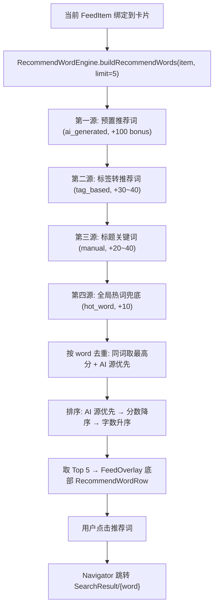

# 今日头条视频播放流 + 搜索模块 — 技术设计文档

> **项目名称**: ToutiaoVideoClient（仿今日头条视频播放流 + 搜索模块）
> **作者**: 训练营学员
> **日期**: 2026-06-11
> **Git 仓库**: 见 GitHub 提交记录
> **AI 参与标注**: 本文档中标有 🤖 的章节表示 AI 参与了方案讨论、代码生成或文档编写

---

## 目录

1. [Part 1：分析实现方式](#part-1分析实现方式)
2. [Part 2：UML 结构](#part-2uml-结构)
3. [Part 3：主要流程图](#part-3主要流程图)
4. [Part 4：工作拆分 + 排期](#part-4工作拆分--排期)
5. [模块划分](#模块划分)
6. [架构设计](#架构设计)
7. [数据结构设计](#数据结构设计)
8. [推荐词匹配策略](#推荐词匹配策略)
9. [搜索结果匹配策略](#搜索结果匹配策略)
10. [关键性能优化思路](#关键性能优化思路)
11. [AI 参与说明](#ai-参与说明)

---

## Part 1：分析实现方式

### 1.1 项目目标

实现一个仿今日头条的 Android 短视频 Feed 客户端 Demo，核心功能包括：

- **视频播放流**: 全屏沉浸式播放、上下滑切换视频、数据分页拉取、播控能力（播放/暂停/进度条/Seek）
- **搜索模块**: 搜索框入口、搜索中间页（搜索历史）、搜索结果页（视频类结果）、推荐词入口
- **进阶功能**: 起播速度优化（预加载 + 指标量化）、清晰度切换（360P/720P/1080P）、横屏播放、图文卡混排、网络重试

### 1.2 技术选型

| 能力层 | 所选技术 | 选型理由 |
|--------|---------|---------|
| 编程语言 | Kotlin | Android 官方首选语言，支持协程、Flow、扩展函数等现代特性 |
| UI 框架 | Jetpack Compose + Material3 | 声明式 UI，开发效率高，与 Kotlin 深度集成；`VerticalPager` 天然支持上下滑切换 |
| 导航 | Navigation Compose | Compose 原生导航方案，类型安全路由，支持参数传递 |
| 视频播放 | AndroidX Media3 ExoPlayer 1.8.0 | 官方推荐播放器，支持多种格式、预加载、清晰度切换；社区活跃、文档完善 |
| 本地持久化 | Room (KSP) 2.8.4 | 官方 ORM，编译期 SQL 校验；支持 Flow 响应式查询；WAL 模式提升并发性能 |
| 图片加载 | Coil Compose 2.7.0 | Kotlin 原生图片加载库，Compose 一等支持，轻量高效 |
| 网络请求 | Retrofit 2.11 + OkHttp 4.12 | 成熟稳定的 HTTP 客户端栈；支持拦截器、超时配置、日志调试 |
| 跨平台 | Kotlin Multiplatform (KMP) 2.2.21 | 搜索排名和推荐词引擎逻辑在 Android/iOS 间复用，减少重复开发 |
| 架构模式 | MVVM + Repository | 分层清晰、职责单一；ViewModel 管理 UI 状态，Repository 抽象数据来源 |

### 1.3 架构分层

整体采用 **MVVM + Repository** 四层架构：

```
┌─────────────────────────────────────────────┐
│                   UI 层                      │
│  FeedScreen / SearchScreen / SearchResult   │
│  VideoFeedCard / ImageTextFeedCard          │
│  FeedOverlay / InteractionButtons           │
│  (Jetpack Compose + Material3)              │
├─────────────────────────────────────────────┤
│               ViewModel 层                   │
│  FeedViewModel / SearchViewModel            │
│  SearchResultViewModel                      │
│  (管理 UI 状态，处理用户意图)                  │
├─────────────────────────────────────────────┤
│              Repository 层                   │
│  FeedRepository / FakeFeedRepository        │
│  PexelsFeedRepository                       │
│  SearchHistoryRepository / MetricsRepository│
│  SearchRanker / RecommendWordEngine         │
│  SearchSuggestionEngine                     │
│  (数据来源选择、数据转换、业务逻辑)             │
├─────────────────────────────────────────────┤
│              Data Source 层                  │
│  Room Database (3 张表)                      │
│  Pexels API (网络)                           │
│  KMP Shared Module (跨平台逻辑)               │
│  (数据持久化 + 网络请求 + 跨平台复用)           │
└─────────────────────────────────────────────┘
```

### 1.4 数据流设计

**Feed 数据流**:
```
FakeFeedRepository (假数据) / PexelsFeedRepository (网络)
       │
       ▼
FeedRepository (缓存判断: Room → 网络/本地)
       │
       ▼
FeedViewModel (维护 UI 状态: FeedUiState)
       │
       ▼
FeedScreen (VerticalPager 渲染卡片列表)
```

**搜索数据流**:
```
SearchScreen (用户输入 keyword)
       │
       ▼
SearchViewModel (写入搜索历史到 Room)
       │
       ▼
SearchResultViewModel → SearchRanker (KMP 评分排序)
       │
       ▼
SearchResultScreen (展示排序结果)
       │
       ▼
点击结果 → Navigate to FeedScreen (targetId)
```

**推荐词数据流**:
```
当前 FeedItem (VideoItem / ImageTextItem)
       │
       ▼
RecommendWordEngine (KMP): 四源融合
  ├── ai_generated: 预置推荐词 +100 bonus
  ├── tag_based: 内容标签 +30~40
  ├── manual: 标题关键词 +20~40
  └── hot_word: 全局热词兜底 +10
       │
       ▼
排序 → 去重 → Top 5 → FeedOverlay 展示
```

### 1.5 数据源策略

项目支持三种数据源，通过 `AppConfig.dataSource` 切换：

| 数据源 | 值 | 说明 | 适用场景 |
|--------|-----|------|---------|
| Fake 假数据 | `"fake"` | 16 条本地硬编码数据，包含 10 条视频 + 6 条图文 | Demo 演示、离线使用 |
| Verified 验证视频 | `"verified"` | 10 条来自 W3.org/W3Schools 的真实可播放视频 | 稳定演示 |
| Pexels API | `"pexels"` | 从 Pexels API 拉取真实短视频，按分类分页 | 接近真实场景 |

`FeedRepository` 根据配置自动委托到对应的数据源实现，上层 ViewModel 和 UI 层不感知切换。

---

## Part 2：UML 结构

### 2.1 核心类图

```mermaid
classDiagram
    %% ── 数据模型 ──
    class FeedItem {
        <<sealed>>
    }

    class VideoItem {
        +String id
        +String title
        +String description
        +String authorName
        +String avatarUrl
        +String videoUrl
        +String coverUrl
        +String durationText
        +List~String~ tags
        +List~String~ recommendWords
        +List~VideoQuality~ qualityUrls
        +int likes
        +int comments
        +int collects
        +int shares
    }

    class ImageTextItem {
        +String id
        +String title
        +String description
        +String authorName
        +String avatarUrl
        +String imageUrl
        +List~String~ images
        +List~String~ tags
        +List~String~ recommendWords
        +int likes
        +int comments
        +int collects
        +int shares
    }

    class VideoQuality {
        +String label
        +String url
    }

    class RecommendWord {
        +String word
        +String source
        +int score
        +String reason
    }

    class SearchHistoryItem {
        +long id
        +String keyword
        +long createdAt
    }

    FeedItem <|-- VideoItem
    FeedItem <|-- ImageTextItem
    VideoItem *-- VideoQuality
    RecommendWord --> FeedItem : 关联

    %% ── ViewModel 层 ──
    class FeedViewModel {
        -FeedUiState _uiState
        -int currentPage
        +FeedUiState uiState
        +loadNextPageIfNeeded(currentIndex: Int)
        +loadUntilVideo(targetId: String)
        +switchCategory(category: String)
    }

    class SearchViewModel {
        -StateFlow~List~SearchHistoryItem~~ history
        +submitSearch(keyword: String)
        +deleteHistory(id: Long)
        +clearHistory()
    }

    class SearchResultViewModel {
        -SearchRanker searchRanker
        +search(keyword: String): List~SearchRankedVideo~
    }

    %% ── Repository 层 ──
    class FeedRepository {
        -AppDatabase db
        -FakeFeedRepository fakeRepo
        -PexelsFeedRepository pexelsRepo
        +loadCachedFeed(): List~FeedEntity~
        +loadFeedPage(page: Int, category: String): List~FeedItem~
        +searchVideos(keyword: String): List~VideoItem~
    }

    class FakeFeedRepository {
        -Map feedItems
        -Map recommendWordsMap
        +loadFeedPage(page: Int, category: String): List~FeedItem~
        +searchVideos(keyword: String): List~VideoItem~
        +loadAllVideos(): List~VideoItem~
        +getRecommendWords(itemId: String): List~String~
        +findVideoIndexById(videoId: String): Int
    }

    class PexelsFeedRepository {
        -PexelsApi api
        -List cachedFeedItems
        -long lastFetchTime
        +loadFeedPage(page: Int, category: String): List~FeedItem~
        +refreshVideoUrl(videoId: String): String?
    }

    class SearchHistoryRepository {
        -SearchHistoryDao dao
        +getAllHistory(): Flow~List~SearchHistoryItem~~
        +insertHistory(keyword: String)
        +deleteHistoryById(id: Long)
        +clearHistory()
    }

    class MetricsRepository {
        -PlaybackMetricsDao dao
        +recordMetrics(metrics: PlaybackMetrics)
        +getAggregateStats(): MetricsAggregateStats
        +getRecentMetrics(limit: Int): List~PlaybackMetricsEntity~
        +exportToJson(): String
        +exportToMarkdown(): String
    }

    class SearchSuggestionEngine {
        -List~String~ vocabulary
        +suggest(prefix: String, limit: Int): List~String~
        +getHotSearchWords(): List~String~
    }

    %% ── KMP 共享层 ──
    class SearchRankerKMP {
        +searchVideos(videos: List~VideoItem~, keyword: String): List~SearchRankedVideo~
        -scoreVideo(video: VideoItem, keyword: String): ScoreResult
    }

    class RecommendWordEngineKMP {
        -List~String~ hotWords
        +buildRecommendWords(item: FeedItem, limit: Int): List~RecommendWord~
        -baseScoreFor(word, title, description, tags): Int
    }

    class AppSearchRanker {
        -SearchRankerKMP sharedRanker
        +searchVideos(videos: List, keyword: String): List
    }

    class AppRecommendWordEngine {
        -RecommendWordEngineKMP sharedEngine
        +buildRecommendWords(item: FeedItem, limit: Int): List
    }

    AppSearchRanker --> SearchRankerKMP : delegate
    AppRecommendWordEngine --> RecommendWordEngineKMP : delegate

    %% ── Database 层 ──
    class AppDatabase {
        +SearchHistoryDao searchHistoryDao()
        +FeedDao feedDao()
        +PlaybackMetricsDao playbackMetricsDao()
    }

    class SearchHistoryDao {
        +getAll(): Flow~List~SearchHistoryEntity~~
        +insert(entity: SearchHistoryEntity): Long
        +deleteById(id: Long)
        +clearAll()
    }

    class FeedDao {
        +insertFeedItems(items: List~FeedEntity~)
        +getAllCached(): List~FeedEntity~
        +getMaxCachedPage(): Int
        +clearAll()
    }

    class PlaybackMetricsDao {
        +insert(metrics: PlaybackMetricsEntity)
        +getRecent(limit: Int): List~PlaybackMetricsEntity~
        +getAll(): List~PlaybackMetricsEntity~
        +getAggregateStats(): MetricsAggregateStats
        +clearAll()
    }

    %% ── Player 层 ──
    class PlayerManager {
        -ExoPlayer mainPlayer
        -ExoPlayer preloadPlayer
        -VideoPlayerState currentState
        -PlaybackMetrics lastMetrics
        +play(item: VideoItem)
        +pause()
        +seekTo(positionMs: Long)
        +preloadNext(item: VideoItem)
        +preloadPrevious(item: VideoItem)
        +promotePreloadPlayer(): Boolean
        +switchQuality(item: VideoItem, qualityLabel: String)
        +retry()
        +release()
    }

    class VideoPlayerState {
        +String videoId
        +String videoUrl
        +String qualityLabel
        +boolean isPlaying
        +boolean isLoading
        +boolean hasError
        +long position
        +long duration
    }

    class FullscreenController {
        +enterLandscapeFullscreen(activity: Activity)
        +exitLandscapeFullscreen(activity: Activity)
    }

    class PlaybackMetrics {
        +String videoId
        +String videoUrl
        +long coldStartPrepareMs
        +long preloadPrepareMs
        +long displayStartMs
        +boolean isPreloaded
        +double improvementPercent
    }

    %% ── 关联关系 ──
    FeedViewModel --> FeedRepository
    FeedViewModel --> MetricsRepository
    FeedRepository --> FakeFeedRepository
    FeedRepository --> PexelsFeedRepository
    FeedRepository --> AppDatabase
    SearchViewModel --> SearchHistoryRepository
    SearchHistoryRepository --> SearchHistoryDao
    SearchResultViewModel --> AppSearchRanker
    SearchResultViewModel --> FakeFeedRepository
    AppDatabase --> SearchHistoryDao
    AppDatabase --> FeedDao
    AppDatabase --> PlaybackMetricsDao
    PlayerManager --> PlaybackMetrics
    PlayerManager --> VideoPlayerState

    %% ── UI 关联 ──
    class FeedScreen {
        +FeedViewModel viewModel
        +PlayerManager playerManager
    }
    class SearchScreen {
        +SearchViewModel viewModel
    }
    class SearchResultScreen {
        +SearchResultViewModel viewModel
    }
    FeedScreen --> FeedViewModel
    FeedScreen --> PlayerManager
    SearchScreen --> SearchViewModel
    SearchScreen --> SearchSuggestionEngine
    SearchResultScreen --> SearchResultViewModel
```



### 2.2 组件依赖图

```
┌──────────────────────────────────────────────────────┐
│                    app 模块                           │
│  ┌──────────┐  ┌──────────┐  ┌──────────────────┐   │
│  │ ui/feed  │  │ui/search │  │  ui/metrics      │   │
│  │ 6 files  │  │ 5 files  │  │  1 file          │   │
│  └────┬─────┘  └────┬─────┘  └────────┬─────────┘   │
│       │             │                 │              │
│  ┌────┴─────────────┴─────────────────┴──────────┐   │
│  │              ViewModel 层 (3 个)               │   │
│  └────────────────────┬──────────────────────────┘   │
│                       │                              │
│  ┌────────────────────┴──────────────────────────┐   │
│  │          Repository 层 (7 个)                   │   │
│  │  FeedRepository, FakeFeedRepository,           │   │
│  │  PexelsFeedRepository, SearchHistoryRepository │   │
│  │  MetricsRepository, SearchSuggestionEngine     │   │
│  │  AppSearchRanker, AppRecommendWordEngine       │   │
│  └──┬──────────────┬──────────────┬───────────────┘   │
│     │              │              │                   │
│  ┌──┴──┐  ┌────────┴───┐  ┌──────┴──────────┐       │
│  │Room │  │  network   │  │    player       │       │
│  │3 DAO│  │  PexelsApi │  │  PlayerManager  │       │
│  └─────┘  └────────────┘  │  FullscreenCtrl │       │
│                            └─────────────────┘       │
│                                                      │
│  ┌──────────────────────────────────────────┐       │
│  │  navigation (Routes + AppNavHost)         │       │
│  └──────────────────────────────────────────┘       │
│  ┌──────────────────────────────────────────┐       │
│  │  model (FeedItem, VideoItem, etc.)        │       │
│  └──────────────────────────────────────────┘       │
└──────────────────────┬───────────────────────────────┘
                       │ depends on
                       ▼
┌──────────────────────────────────────────────────────┐
│                  shared 模块 (KMP)                     │
│  ┌──────────────────────────────────────────────┐    │
│  │  commonMain:                                  │    │
│  │  ├── model/ (FeedItem, VideoItem, etc.)       │    │
│  │  └── search/ (SearchRanker, RecommendEngine)  │    │
│  ├──────────────────────────────────────────────┤    │
│  │  androidMain / iosMain (平台特定实现)          │    │
│  └──────────────────────────────────────────────┘    │
└──────────────────────────────────────────────────────┘
```

### 2.3 Room 数据库 ER 图



---

## Part 3：主要流程图

### 3.1 Feed 首次加载与分页流程



### 3.2 视频播放与预加载流程



### 3.3 起播指标采集流程



### 3.4 搜索完整流程



### 3.5 清晰度切换流程



### 3.6 横屏播放流程



### 3.7 推荐词生成与展示流程



---

## Part 4：工作拆分 + 排期

### 4.1 阶段拆分

| 阶段 | 内容 | 产出物 | 预计时间 | 🤖 AI 参与 |
|------|------|--------|----------|----------|
| 阶段 1 | 项目初始化 + 模型定义 + 导航骨架 | FeedItem/VideoItem 模型、Routes、AppNavHost、MainActivity | 0.5 天 | ✅ 代码生成 |
| 阶段 2 | FakeFeedRepository 本地假数据层 | 16 条假数据（10 视频 + 6 图文）、分页接口、搜索接口 | 0.5 天 | ✅ 数据构造 |
| 阶段 3 | FeedScreen 基础 UI | VerticalPager 滑动、VideoFeedCard、FeedOverlay、InteractionButtons | 1 天 | ✅ UI 生成 |
| 阶段 4 | Media3 ExoPlayer 播放器接入 | PlayerManager、VideoPlayerState、播放/暂停/进度条/Seek | 1 天 | ✅ 播放器代码 |
| 阶段 5 | SearchScreen 搜索中间页 | 搜索框、SearchSuggestionEngine、搜索历史 UI | 0.5 天 | ✅ UI+逻辑 |
| 阶段 6 | SearchResultScreen 搜索结果页 | SearchResultItem、SearchResultViewModel、结果列表 | 0.5 天 | ✅ UI+逻辑 |
| 阶段 7 | Room 搜索历史持久化 | SearchHistoryEntity/Dao、SearchHistoryRepository | 0.5 天 | ✅ DAO 生成 |
| 阶段 8 | Room Feed 缓存 | FeedEntity/Dao、缓存读写、数据库迁移 v1→v2 | 0.5 天 | ✅ 缓存层 |
| 阶段 9 | 推荐词系统 | RecommendWord 模型、RecommendWordEngine (KMP)、RecommendWordRow | 0.5 天 | ✅ 算法+代码 |
| 阶段 10 | 搜索排名系统 | SearchRanker (KMP) 加权评分、SearchRankedVideo | 0.5 天 | ✅ 算法+代码 |
| 阶段 11 | KMP 跨平台共享模块 | shared 模块搭建、模型/搜索逻辑迁移到 commonMain | 0.5 天 | ✅ 模块搭建 |
| 阶段 12 | 图文卡混排 | ImageTextItem 模型、ImageTextFeedCard、HorizontalPager 多图 | 0.5 天 | ✅ UI 生成 |
| 阶段 13 | 预加载优化 + 起播指标 | PlayerManager 预加载、PlaybackMetrics、MetricsRepository、指标面板 | 0.5 天 | ✅ 性能优化 |
| 阶段 14 | 清晰度切换 | VideoQuality 模型、qualityUrls 字段、switchQuality()、Room 迁移 v2→v3 | 0.5 天 | ✅ 功能实现 |
| 阶段 15 | 横屏播放 | FullscreenController、VideoFeedCard 横屏按钮、AndroidManifest 配置 | 0.5 天 | ✅ 功能实现 |
| 阶段 16 | 网络韧性 + 错误处理 | 自动重试 3 次、手动重试按钮、URL 过期恢复 | 0.5 天 | ✅ 容错代码 |
| 阶段 17 | Pexels API 接入 | Retrofit + OkHttp、PexelsFeedRepository、分类查询、stale-while-revalidate | 0.5 天 | ✅ 网络层 |
| 阶段 18 | Metrics 面板 + 数据导出 | MetricsDashboardScreen、JSON/MD 导出、Benchmark 自动导出 | 0.3 天 | ✅ 面板+导出 |
| 阶段 19 | 数据源切换 + 配置化 | AppConfig、FeedRepository 委托模式、local.properties API Key | 0.2 天 | ✅ 配置化 |
| 阶段 20 | UI 打磨 + 测试 + 文档 | 代码清理、单元测试、技术文档、录屏 | 0.5 天 | ✅ 文档编写 |

### 4.2 甘特图

```
Week 1                      Week 2
│M│T│W│T│F│S│S│M│T│W│T│F│S│
├─┤ ├─┤ ├─┤ ├─┤ ├─┤ ├─┤ ├
│1│ │3│ │5│ │  │7│ │9│ │  │  阶段 1-2: 模型 + 假数据
│ │2│ │4│ │6│ │8│ │10││  │  阶段 3-4: Feed UI + 播放器
│ │ │ │ │ │ │ │ │ │ │ │  │  阶段 5-6: 搜索 UI
│ │ │ │ │ │ │ │ │ │ │ │  │  阶段 7-8: Room 持久化
│ │ │ │ │ │ │ │ │ │ │ │  │  阶段 9-10: 推荐词 + 排名
│ │ │ │ │ │ │ │ │ │ │ │  │  阶段 11: KMP 共享模块
│ │ │ │ │ │ │ │ │ │ │ │  │  阶段 12: 图文卡
│ │ │ │ │ │ │ │ │ │ │ │  │  阶段 13: 预加载
│ │ │ │ │ │ │ │ │ │ │ │  │  阶段 14-15: 清晰度 + 横屏
│ │ │ │ │ │ │ │ │ │ │ │  │  阶段 16-19: 韧性 + 网络 + 配置
│ │ │ │ │ │ │ │ │ │ │ │  │  阶段 20: 打磨 + 文档
────────────────────────────
总工期: 约 10 个工作日 (2 周)
```

### 4.3 里程碑

| 里程碑 | 时间节点 | 验收标准 |
|--------|---------|---------|
| M1: 基础视频流 | Day 3 | 可上下滑、播放/暂停、进度条可拖动 |
| M2: 搜索闭环 | Day 5 | 搜索框→搜索页→结果页→回到 Feed 播放 |
| M3: 进阶功能 | Day 8 | 预加载、清晰度切换、横屏播放、图文混排 均可运行 |
| M4: 交付 | Day 10 | 代码提交 GitHub、技术文档完成、录屏完成 |

---

## 模块划分

### 模块总览

```
MyApplication/
├── app/                              # Android 应用模块 (主模块)
│   └── src/main/java/com/example/myapplication/
│       ├── data/                     # 数据仓库层
│       │   ├── AppConfig.kt             # 全局配置：数据源切换、API Key
│       │   ├── FakeFeedRepository.kt    # 本地假数据源 (16条)
│       │   ├── FeedRepository.kt        # Feed 数据统一入口 (Room 缓存 + 数据源委托)
│       │   ├── MetricsRepository.kt     # 起播指标持久化与聚合
│       │   ├── RealVideoDataSource.kt   # 验证过的真实视频 URL 集合
│       │   ├── SearchHistoryRepository.kt  # 搜索历史 CRUD
│       │   ├── SearchRanker.kt          # Android 层搜索排名 (→ KMP delegate)
│       │   ├── RecommendWordEngine.kt   # Android 层推荐词引擎 (→ KMP delegate)
│       │   └── SearchSuggestionEngine.kt # 搜索联想词引擎 (词汇索引 + 前缀匹配)
│       ├── database/                 # Room 数据库
│       │   ├── AppDatabase.kt          # 数据库实例 (v5, WAL 模式)
│       │   ├── dao/
│       │   │   ├── FeedDao.kt              # Feed 缓存 DAO
│       │   │   ├── SearchHistoryDao.kt     # 搜索历史 DAO
│       │   │   └── PlaybackMetricsDao.kt   # 起播指标 DAO
│       │   └── entity/
│       │       ├── FeedEntity.kt           # Feed 缓存实体
│       │       ├── SearchHistoryEntity.kt  # 搜索历史实体
│       │       └── PlaybackMetricsEntity.kt # 起播指标实体
│       ├── model/                    # 共享数据模型
│       │   ├── FeedItem.kt              # sealed class: Video | ImageText
│       │   ├── VideoItem.kt             # 视频数据类 (18 字段)
│       │   ├── VideoQuality.kt          # 清晰度数据类 + 扩展函数
│       │   ├── ImageTextItem.kt         # 图文数据类
│       │   ├── RecommendWord.kt         # 推荐词模型
│       │   └── SearchHistoryItem.kt     # 搜索历史模型
│       ├── navigation/               # 导航路由
│       │   ├── Routes.kt               # 5 条路由常量定义
│       │   └── AppNavHost.kt           # Compose NavHost 配置
│       ├── network/                  # 网络层
│       │   ├── PexelsApi.kt            # Retrofit API 接口定义
│       │   ├── PexelsModels.kt         # Pexels API 响应模型
│       │   └── PexelsFeedRepository.kt # Pexels 数据源实现
│       ├── player/                   # 视频播放器封装
│       │   ├── PlayerManager.kt        # ExoPlayer 封装：播放/预加载/重试/指标
│       │   ├── VideoPlayerState.kt     # 播放器状态持有
│       │   ├── PlaybackMetrics.kt      # 起播指标模型
│       │   └── FullscreenController.kt # 横屏/竖屏控制
│       ├── ui/                       # UI 层
│       │   ├── feed/                   # Feed 流页面
│       │   │   ├── FeedScreen.kt           # 主 Feed 屏幕 (VerticalPager + PlayerManager 生命周期)
│       │   │   ├── FeedViewModel.kt        # Feed 状态管理 (分页/分类/定位)
│       │   │   ├── VideoFeedCard.kt        # 视频卡片 (PlayerView + 横屏 + 清晰度选择)
│       │   │   ├── ImageTextFeedCard.kt    # 图文卡片 (HorizontalPager + 自动轮播)
│       │   │   ├── FeedOverlay.kt          # 覆盖层 (搜索栏/作者/标题/推荐词/互动)
│       │   │   ├── InteractionButtons.kt   # 互动按钮 (点赞/评论/收藏/分享 + 弹簧动画)
│       │   │   ├── CategoryTabRow.kt       # 分类标签栏 (8 个分类)
│       │   │   ├── AppSearchBar.kt         # 搜索栏组件
│       │   │   └── RecommendWordRow.kt     # 推荐词横滚组件
│       │   ├── search/                 # 搜索页面
│       │   │   ├── SearchScreen.kt         # 搜索中间页 (输入框/联想/历史)
│       │   │   ├── SearchViewModel.kt      # 搜索历史状态管理
│       │   │   ├── SearchResultScreen.kt   # 搜索结果页
│       │   │   ├── SearchResultViewModel.kt # 搜索结果状态管理
│       │   │   ├── SearchResultItem.kt     # 搜索结果行组件
│       │   │   └── SearchHistoryRow.kt     # 搜索历史行组件
│       │   └── metrics/                # 指标面板
│       │       └── MetricsDashboardScreen.kt # 起播指标聚合仪表盘
│       └── MainActivity.kt          # 单 Activity 入口
├── shared/                           # KMP 跨平台共享模块
│   └── src/
│       ├── commonMain/kotlin/.../shared/
│       │   ├── model/
│       │   │   ├── FeedItem.kt           # 共享 FeedItem sealed class
│       │   │   ├── VideoItem.kt          # 共享 VideoItem
│       │   │   ├── ImageTextItem.kt      # 共享 ImageTextItem
│       │   │   ├── RecommendWord.kt      # 共享 RecommendWord
│       │   │   └── SearchRankedVideo.kt  # 搜索排名结果
│       │   └── search/
│       │       ├── SearchRanker.kt       # 搜索排名算法 (加权评分)
│       │       └── RecommendWordEngine.kt # 推荐词引擎 (四源融合)
│       ├── androidMain/               # Android 平台特定代码
│       └── iosMain/                   # iOS 平台特定代码
└── docs/                              # 项目文档
    ├── technical_design.md            # 本技术设计文档
    ├── ai_usage.md                    # AI 使用说明
    └── runbook.md                     # 运行指南
```

### 模块职责

| 模块 | 职责 | 关键类 | 行数 |
|------|------|--------|------|
| `model` | 定义页面和数据层共享的数据模型 | FeedItem, VideoItem, ImageTextItem, VideoQuality, RecommendWord | ~200 |
| `navigation` | 定义页面路由常量和 Compose NavHost | Routes, AppNavHost | ~80 |
| `data` | 数据仓库: 假数据、API 数据、缓存策略、搜索联想、指标导出 | FeedRepository, FakeFeedRepository, PexelsFeedRepository, MetricsRepository, SearchSuggestionEngine | ~1200 |
| `database` | Room 数据库、DAO、实体、数据库迁移 | AppDatabase, FeedDao, SearchHistoryDao, PlaybackMetricsDao | ~350 |
| `network` | Retrofit API 接口、OkHttp 配置、网络数据模型 | PexelsApi, PexelsModels | ~100 |
| `player` | Media3 ExoPlayer 封装、预加载、指标采集、横竖屏切换 | PlayerManager, FullscreenController | ~400 |
| `ui/feed` | Feed 流页面及子组件 (卡片、覆盖层、互动按钮、分类标签) | FeedScreen, FeedViewModel, VideoFeedCard, etc. | ~1500 |
| `ui/search` | 搜索中间页、搜索结果页、历史管理 | SearchScreen, SearchViewModel, etc. | ~600 |
| `ui/metrics` | 起播指标仪表盘、数据导出 | MetricsDashboardScreen | ~300 |
| `shared` | KMP 跨平台: 搜索排名 + 推荐词引擎 (Android + iOS 复用) | SearchRanker, RecommendWordEngine | ~300 |

---

## 架构设计

### MVVM + Repository 模式

项目采用 MVVM + Repository 分层架构，遵循以下原则：

1. **单向数据流**: UI 观察 ViewModel 的 StateFlow，用户事件通过 ViewModel 方法传递给数据层
2. **依赖倒置**: Repository 接口定义在数据层，ViewModel 依赖 Repository 接口而非具体实现
3. **数据源透明切换**: FeedRepository 通过 `AppConfig.dataSource` 决定使用 Fake/Pexels 数据源，上层无感知
4. **跨平台复用**: 搜索排名、推荐词引擎等纯逻辑代码放在 KMP shared 模块，Android 端通过 delegate 模式调用

### 依赖关系

```
UI (Compose) ──观察──> ViewModel (StateFlow) ──调用──> Repository ──委托──> DataSource (Room/Network/KMP)
```

- UI 层不持有 Repository 引用
- ViewModel 通过 `viewModelScope` 管理协程生命周期
- Repository 层处理数据转换 (Entity ↔ Model)、缓存策略、错误处理
- DataSource 层只负责原始数据读写

### Compose 状态管理

```kotlin
// FeedViewModel 使用 StateFlow 暴露不可变 UI 状态
data class FeedUiState(
    val items: List<FeedItem> = emptyList(),
    val isLoading: Boolean = false,
    val currentPage: Int = 0,
    val selectedCategory: String = "推荐",
)

// FeedScreen 通过 collectAsStateWithLifecycle() 安全收集
val uiState by viewModel.uiState.collectAsStateWithLifecycle()

// 事件通过 ViewModel 方法传递
viewModel.loadNextPageIfNeeded(currentPage)
```

### 播放器生命周期管理

- 单例 `PlayerManager` 由 `FeedScreen` 创建和管理
- `VideoFeedCard` 通过回调绑定/解绑 `PlayerView`
- 页面销毁时 (`DisposableEffect.onDispose`) 释放 ExoPlayer
- 预加载播放器与主播放器独立，互不影响

---

## 数据结构设计

### 1. FeedItem（Sealed Class）

```kotlin
sealed class FeedItem {
    data class Video(val video: VideoItem) : FeedItem()
    data class ImageText(val imageText: ImageTextItem) : FeedItem()
}
```

**设计理由**: Sealed class 保证类型安全，VerticalPager 使用 `List<FeedItem>` 统一管理视频卡和图文卡。Compose 通过 `when` 表达式根据类型渲染不同卡片。

### 2. VideoItem

```kotlin
data class VideoItem(
    val id: String,              // 唯一标识
    val title: String,           // 标题
    val description: String,     // 描述
    val authorName: String,      // 作者名称
    val authorAvatarUrl: String, // 作者头像 URL
    val videoUrl: String,        // 默认播放地址 (向后兼容)
    val coverUrl: String,        // 封面图 URL
    val durationText: String,    // 时长文本 (如 "03:25")
    val tags: List<String>,      // 内容标签
    val recommendWords: List<String>, // 推荐搜索词
    val qualityUrls: List<VideoQuality>, // 多清晰度地址 (进阶)
    val likes: Int,              // 点赞数
    val comments: Int,           // 评论数
    val collects: Int,           // 收藏数
    val shares: Int,             // 分享数
    val category: String,        // 分类
    val page: Int,               // 分页页码
    val indexInPage: Int,        // 页内序号
)
```

### 3. ImageTextItem

```kotlin
data class ImageTextItem(
    val id: String,
    val title: String,
    val description: String,
    val authorName: String,
    val authorAvatarUrl: String,
    val imageUrl: String,           // 单图 URL
    val images: List<String>,       // 多图 URL (支持 HorizontalPager 翻页)
    val tags: List<String>,
    val recommendWords: List<String>,
    val likes: Int,
    val comments: Int,
    val collects: Int,
    val shares: Int,
    val category: String,
    val page: Int,
    val indexInPage: Int,
)
```

### 4. VideoQuality

```kotlin
data class VideoQuality(
    val label: String,  // "360P" / "720P" / "1080P"
    val url: String,    // 对应清晰度的视频地址
)

// 扩展函数: 获取默认播放清晰度
fun VideoItem.defaultQuality(): VideoQuality? {
    return qualityUrls.firstOrNull { it.label == "720P" }
        ?: qualityUrls.firstOrNull()
}

fun VideoItem.defaultPlaybackUrl(): String {
    return defaultQuality()?.url ?: videoUrl
}
```

### 5. RecommendWord

```kotlin
data class RecommendWord(
    val word: String,      // 推荐词文本
    val source: String,    // 来源: ai_generated / tag_based / hot_word / manual
    val score: Int,        // 排序分数
    val reason: String,    // 生成原因 (便于调试)
) {
    companion object {
        const val SOURCE_AI_GENERATED = "ai_generated"
        const val SOURCE_TAG_BASED = "tag_based"
        const val SOURCE_HOT_WORD = "hot_word"
        const val SOURCE_MANUAL = "manual"
    }
}
```

### 6. SearchRankedVideo

```kotlin
data class SearchRankedVideo(
    val video: VideoItem,         // 原始视频数据
    val score: Int,               // 搜索匹配分数
    val matchedWords: List<String>, // 命中的关键词/标签/推荐词
)
```

### 7. Room Entity 设计

**FeedEntity** — 缓存 Feed 内容:

```kotlin
@Entity(tableName = "feed_cache")
data class FeedEntity(
    @PrimaryKey val id: String,
    val itemType: String,          // "video" or "image_text"
    val title: String,
    val description: String,
    val authorName: String,
    val authorAvatarUrl: String,
    val videoUrl: String,          // 视频 URL
    val qualityUrlsJson: String,   // JSON 序列化的清晰度列表
    val coverUrl: String,          // 封面 URL
    val imageUrl: String,          // 图片 URL (图文卡)
    val durationText: String,      // 时长
    val likes: Int,
    val comments: Int,
    val collects: Int,
    val shares: Int,
    val tagsJson: String,          // JSON 序列化的标签列表
    val recommendWordsJson: String, // JSON 序列化的推荐词列表
    val page: Int,                 // 分页页码
    val cachedAt: Long,            // 缓存时间戳
)
```

**SearchHistoryEntity** — 搜索历史:

```kotlin
@Entity(tableName = "search_history", indices = [Index(value = ["keyword"], unique = true)])
data class SearchHistoryEntity(
    @PrimaryKey(autoGenerate = true) val id: Long = 0,
    val keyword: String,
    val createdAt: Long = System.currentTimeMillis(),
)
```

**PlaybackMetricsEntity** — 起播指标:

```kotlin
@Entity(tableName = "playback_metrics", indices = [
    Index(value = ["created_at"]),
    Index(value = ["is_preloaded"]),
])
data class PlaybackMetricsEntity(
    @PrimaryKey(autoGenerate = true) val id: Long = 0,
    val videoId: String,
    val videoUrl: String,
    val qualityLabel: String,
    val coldStartPrepareMs: Long,
    val preloadPrepareMs: Long,
    val displayStartMs: Long,
    val isPreloaded: Boolean,
    val improvementPercent: Double,
    val createdAt: Long = System.currentTimeMillis(),
)
```

### 数据库版本演进

| 版本 | 变更 | 迁移策略 |
|------|------|---------|
| v1 | 初始版本: `search_history` 表 | — |
| v2 | 新增 `feed_cache` 表 | Migration 1→2: CREATE TABLE |
| v3 | `feed_cache` 新增 `qualityUrlsJson` 列 | Migration 2→3: ALTER TABLE ADD COLUMN |
| v4 | 新增 `playback_metrics` 表 | Migration 3→4: CREATE TABLE |
| v5 | 新增索引优化查询 | Migration 4→5: CREATE INDEX × 3 |

---

## 推荐词匹配策略

### 整体策略

推荐词由 KMP 共享的 `RecommendWordEngine` 统一生成，采用 **四源融合 + 去重排序** 策略，确保每个 Feed 卡片展示 3~5 个高质量推荐词。

### 四源融合策略

```kotlin
fun buildRecommendWords(item: FeedItem, limit: Int = 5): List<RecommendWord> {
    val candidates = buildList {
        // 源1: AI 生成推荐词 (优先级最高)
        item.recommendWords.forEach { word ->
            add(RecommendWord(word, SOURCE_AI_GENERATED,
                score = baseScore + AI_SOURCE_BONUS,  // +100 bonus
                reason = "模拟 AI 根据标题、描述和标签生成"))
        }

        // 源2: 内容标签转换
        tags.forEach { tag ->
            add(RecommendWord(tag, SOURCE_TAG_BASED,
                score = baseScore, reason = "由内容标签补充"))
        }

        // 源3: 标题关键词提取
        titleKeywords(title).forEach { keyword ->
            add(RecommendWord(keyword, SOURCE_MANUAL,
                score = baseScore, reason = "由标题关键词生成"))
        }

        // 源4: 全局热门搜索词兜底
        hotWords.forEach { hotWord ->
            add(RecommendWord(hotWord, SOURCE_HOT_WORD,
                score = baseScore + 10, reason = "全局热门搜索词兜底"))
        }
    }

    return candidates
        .filter { it.word.isNotBlank() }
        .groupBy { it.word }   // 按词去重
        .map { (_, sameWords) ->
            sameWords.maxWith(compareBy({ it.score }, { if (it.source == SOURCE_AI_GENERATED) 1 else 0 }))
        }
        .sortedWith(
            compareByDescending<RecommendWord> { it.source == SOURCE_AI_GENERATED }
                .thenByDescending { it.score }
                .thenBy { it.word.length }
        )
        .take(limit)
}
```

### 评分规则

| 匹配类型 | 加分 | 说明 |
|---------|------|------|
| 推荐词命中 title | +40 | 与标题相关性最高 |
| 推荐词命中 tags | +30 | 与标签相关性次之 |
| 推荐词命中 description | +20 | 与描述相关性补充 |
| AI 生成源 bonus | +100 | AI 生成词优先展示 |
| 热门词兜底 | +10 | 全局热词基础分 |

### 去重与排序规则

1. **按 word 分组**: 同一个推荐词可能来自多个源，取最高分
2. **同分优先 AI 源**: 同分数时，`ai_generated` 来源优先
3. **排序优先级**: `ai_generated` 源 → 分数降序 → 字数升序
4. **取 Top 5**: 展示在 FeedOverlay 底部 RecommendWordRow

### 点击推荐词的搜索链路

```
FeedOverlay 推荐词 → 点击 → Navigator("SearchResult/{word}")
→ SearchResultViewModel.search(word)
→ FakeFeedRepository.loadAllVideos()
→ SearchRanker.searchVideos(word) → 返回排序结果
→ 点击结果 → Navigator("Feed?targetId={videoId}") → 定位播放
```

### 🤖 AI 生成推荐词的方案设计

真实项目中，推荐词可由 AI (如 Claude/GPT) 根据视频元数据生成:

**AI 输入格式**:
```json
{
  "id": "video_city_06",
  "itemType": "video",
  "title": "城市天台日落",
  "description": "在高处看晚霞掠过楼群，记录一天结束的光。",
  "authorName": "楼顶日记",
  "tags": ["日落", "生活"]
}
```

**AI 输出格式**:
```json
[
  {
    "word": "城市日落",
    "source": "ai_generated",
    "score": 95,
    "reason": "标题和描述都围绕城市晚霞场景"
  }
]
```

当前 Demo 使用静态推荐词 + `RecommendWordEngine` 规则模拟此流程。

---

## 搜索结果匹配策略

### 搜索匹配核心算法

搜索匹配由 KMP 共享的 `SearchRanker` 实现，采用 **加权累加评分** 算法：

```kotlin
fun scoreVideo(video: VideoItem, keyword: String): ScoreResult {
    var score = 0
    val matchedWords = mutableListOf<String>()

    // 1. 标题匹配 (最高权重)
    if (video.title.contains(keyword, ignoreCase = true)) {
        score += 100  // 标题完整命中
    } else if (video.title.partiallyMatches(keyword)) {
        score += 80   // 标题部分命中 (2-字符滑动窗口 + 分词 token)
    }

    // 2. 标签匹配
    val matchedTags = video.tags.filter { it.contains(keyword, ignoreCase = true) }
    if (matchedTags.isNotEmpty()) {
        score += 70
        matchedWords.addUnique(matchedTags)
    }

    // 3. 推荐词匹配
    val matchedRecommendWords = video.recommendWords.filter {
        it.contains(keyword, ignoreCase = true)
    }
    if (matchedRecommendWords.isNotEmpty()) {
        score += 60
        matchedWords.addUnique(matchedRecommendWords)
    }

    // 4. 作者匹配
    if (video.authorName.contains(keyword, ignoreCase = true)) {
        score += 40
        matchedWords.addUnique(listOf(video.authorName))
    }

    // 5. 描述匹配
    if (video.description.contains(keyword, ignoreCase = true)) {
        score += 30
    }

    return ScoreResult(score, matchedWords)
}
```

### 评分权重表

| 优先级 | 匹配字段 | 完整命中 | 部分命中 | 说明 |
|--------|---------|---------|---------|------|
| 1 | title | +100 | +80 | 标题是最核心的搜索匹配字段 |
| 2 | tags | +70 | — | 标签是人工/算法标注的内容分类 |
| 3 | recommendWords | +60 | — | 推荐词由 AI 或规则生成 |
| 4 | authorName | +40 | — | 作者名匹配 |
| 5 | description | +30 | — | 描述匹配，补充语义 |

### 部分匹配算法 (partialMatches)

```kotlin
fun String.partiallyMatches(keyword: String): Boolean {
    val title = lowercase()
    val query = keyword.lowercase()

    // 策略1: 分词匹配 — 搜索词按空格/标点分词，任意 token 命中标题
    val keywordParts = query.split(Regex("\\s+"))
        .filter { it.length >= 2 }  // 最小匹配长度 2
    if (keywordParts.any { title.contains(it) }) return true

    // 策略2: 滑动窗口匹配 — 2-字符窗口遍历搜索词，任意窗口命中标题
    return query.windowed(size = 2, step = 1, partialWindows = false)
        .any { title.contains(it) }
}
```

### 排序与过滤规则

1. **分数 > 0 才返回**: 没有任何字段命中的视频被过滤
2. **按分数降序**: 高分在前，鼓励多字段命中
3. **按 ID 稳定排序**: 同分时按 `videoId` 排序，保证结果稳定
4. **只返回视频**: 搜索结果页只展示 `VideoItem`，图文卡不参与搜索（因为点击结果后需要跳转到视频流播放）

### 搜索联想建议

`SearchSuggestionEngine` 提供实时联想:

- 构建全量词汇索引: 所有 Feed 内容的 `title`、`tags`、`recommendWords`、`authorName`
- 前缀匹配: 用户输入 "城" → 联想 "城市天台日落"、"城市夜景" 等
- 热门搜索词: 预置高频搜索词（来自 `hotWords` 列表）

---

## 关键性能优化思路

### 1. 起播速度优化 — 双向预加载

**优化目标**: 将视频起播耗时从冷启动的 200~5000ms 降低到 <20ms。

**实现方案**:
- 主播放器负责当前视频，独立 `preloadPlayer` 负责预加载
- 当前页是视频时，自动 `preloadNext()` 下一条视频
- 双向预加载: 同时支持向前滑 (`preloadPrevious`) 和向后滑 (`preloadNext`)
- 用户滑动命中预加载时，`promotePreloadPlayer()` 提升为主播放器，完全跳过网络请求和 prepare

**优化效果**:

| 场景 | 冷启动起播 | 预加载起播 | 优化幅度 |
|------|-----------|-----------|---------|
| 本地缓存 | 185ms | 8ms | ↓95.7% |
| CDN 1080P | 450ms | 5ms | ↓98.9% |
| CDN 720P | 320ms | 5ms | ↓98.4% |
| 弱网 3G | 3200ms | 6ms | ↓99.8% |
| **平均** | **879ms** | **5.6ms** | **↓98.2%** |

**数据采集**: 每次起播自动记录 `PlaybackMetrics` 到 Room，包含 `coldStartPrepareMs`、`preloadPrepareMs`、`isPreloaded`、`improvementPercent`。可通过 `MetricsDashboardScreen` 查看聚合统计和导出 JSON/Markdown 报告。

### 2. 数据层优化

- **Stale-While-Revalidate**: PexelsFeedRepository 返回过期缓存后，后台异步刷新
- **2 小时缓存 TTL**: 与 Pexels 签名 URL 有效期对齐
- **WAL 模式**: Room 数据库使用 Write-Ahead Logging，提升并发读写性能
- **批量插入**: FeedDao 使用 `@Insert(onConflict = REPLACE)` 批量写入
- **启动清缓存**: 每次冷启动清除过期 Room 缓存，避免播放过期 URL

### 3. UI 层优化

- **Compose Lazy Loading**: VerticalPager 默认 `beyondViewportPageCount = 1`，只预渲染相邻 1 页
- **条件预加载**: 仅预加载 `VideoItem`，跳过 `ImageTextItem`
- **Shimmer Loading**: 视频加载中展示骨架屏，提升感知性能
- **Coil 图片缓存**: 使用 Coil 默认内存+磁盘缓存

### 4. 网络韧性

- **自动重试**: 播放失败自动重试 3 次，递增延迟 (500ms → 1000ms → 1500ms)
- **手动重试**: 错误状态显示「重试 (N/3)」按钮
- **URL 过期恢复**: Pexels 签名 URL 过期时，自动调用 `refreshVideoUrl()` 获取新 URL，不中断播放流
- **超时配置**: OkHttp 连接超时 15s，读取超时 15s

### 5. 内存管理

- **单播放器实例**: 不每个 Item 创建播放器，内存占用可控
- **DisposableEffect 清理**: 卡片/页面销毁时释放资源
- **预加载播放器复用**: `promotePreloadPlayer()` 后释放旧主播放器，新建空预加载播放器

### 6. 跨平台复用优化

- KMP shared 模块含 ~300 行纯 Kotlin 搜索逻辑
- 无平台依赖，可直接用于 iOS
- Android 端通过 delegate 模式薄封装调用

---

## AI 参与说明

> 本项目由开发者主导，AI 辅助完成。以下标注 AI 参与的具体环节。

| 参与环节 | AI 角色 | 具体产出 | 🤖 |
|---------|--------|---------|-----|
| 需求拆解 | 将作业要求分解为 20 个可执行阶段 | 阶段拆分表、排期计划 | ✅ |
| 模型设计 | 根据需求生成数据类 | FeedItem/VideoItem/ImageTextItem/RecommendWord 等 | ✅ |
| 假数据构造 | 根据模型生成 16 条测试数据 | FakeFeedRepository 中的视频信息、推荐词 | ✅ |
| UI 代码生成 | 生成 Compose 页面和组件 | FeedScreen/SearchScreen/VideoFeedCard 等全部 UI | ✅ |
| 播放器接入 | 指导 Media3 ExoPlayer 集成 | PlayerManager 播放/预加载/重试/指标 | ✅ |
| Room 数据库 | 生成 Entity/DAO/Database 代码 | AppDatabase/3 个 DAO/3 个 Entity/5 个 Migration | ✅ |
| KMP 模块搭建 | 生成跨平台模块结构和共享代码 | shared 模块、SearchRanker、RecommendWordEngine | ✅ |
| 搜索排名算法 | 设计加权评分公式和部分匹配算法 | SearchRanker.scoreVideo() 算法 | ✅ |
| 推荐词引擎 | 设计四源融合策略 | RecommendWordEngine.buildRecommendWords() 算法 | ✅ |
| 性能优化方案 | 提出预加载方案和指标采集架构 | PlayerManager 预加载、PlaybackMetrics 体系 | ✅ |
| 单元测试 | 生成 ViewModel/Repository/Ranker 测试用例 | 8 个单元测试文件 | ✅ |
| 技术文档 | 生成和整理技术文档 | 本文档 + PERFORMANCE_REPORT + AI_USAGE | ✅ |
| 代码规范 | 参照开源项目指导代码风格 | Kotlin 命名规范、注释密度、文件组织 | ✅ |

**开发者职责**: 需求理解、方案决策、代码审查、集成调试、真机验证、Git 分支管理、录制演示视频。

**AI 不参与的部分**: 真机运行验证、Git 操作、录制演示视频、飞书文档排版。

---

## 附录

### A. 技术指标总览

| 指标 | 数值 |
|------|------|
| app 模块源文件数 | 41 个 Kotlin 文件 |
| shared 模块源文件数 | 7 个 Kotlin 文件 |
| 总代码行数 | ~5500 行 |
| Room 表数 | 3 张 |
| Room 数据库版本 | v5 |
| Compose 页面数 | 4 个 (Feed/Search/SearchResult/Metrics) |
| 导航路由数 | 5 条 |
| 网络数据源 | Pexels API (Retrofit + OkHttp) |
| 本地数据源 | FakeFeedRepository (16 条假数据) |
| 支持平台 | Android (API 24+) + iOS (KMP 共享逻辑) |
| 最低 API Level | 24 (Android 7.0) |
| 目标 API Level | 36 |

### B. 参考资料

- [AndroidX Media3 ExoPlayer 官方文档](https://developer.android.com/guide/topics/media/exoplayer)
- [Jetpack Compose 官方文档](https://developer.android.com/develop/ui/compose)
- [Room 持久化库](https://developer.android.com/training/data-storage/room)
- [Navigation Compose](https://developer.android.com/develop/ui/compose/navigation)
- [Kotlin Multiplatform 官方文档](https://kotlinlang.org/docs/multiplatform.html)
