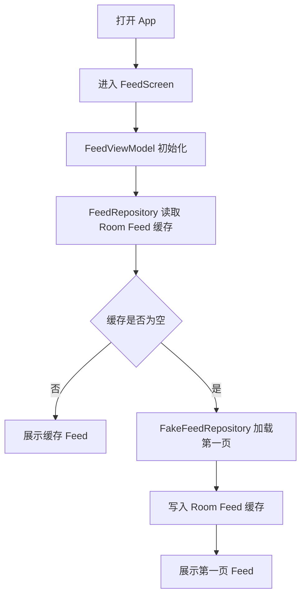
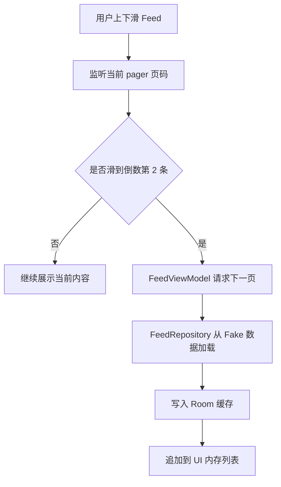
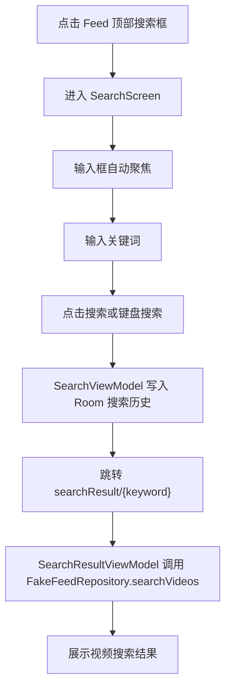
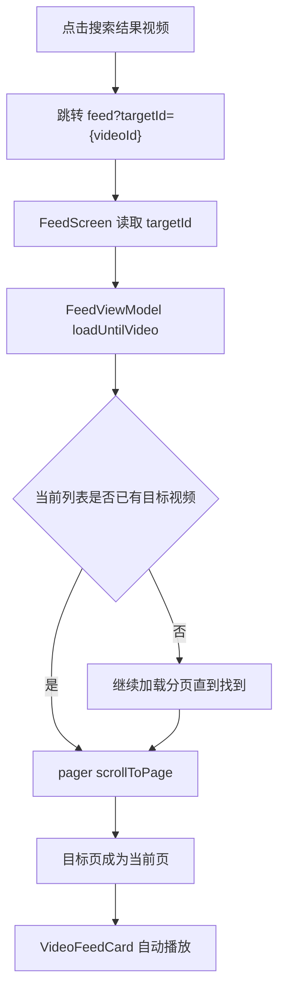
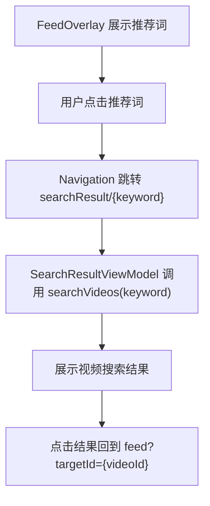
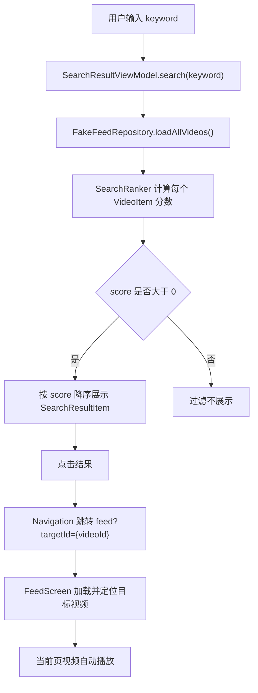
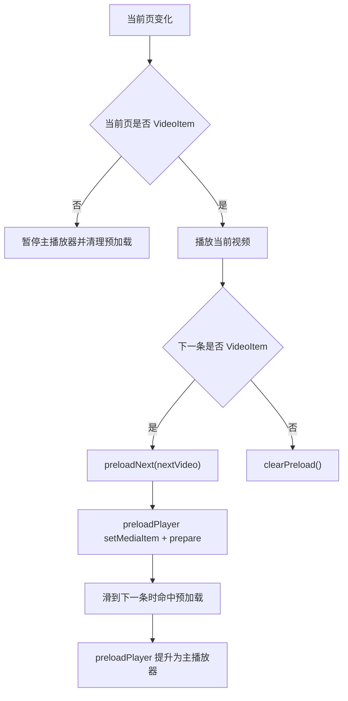

# 技术设计文档

## Part 1：分析实现方式

本项目目标是实现一个仿今日头条的视频播放流 + 搜索模块 Android Demo。整体采用 MVVM + Repository 架构，UI 使用 Jetpack Compose，页面跳转使用 Navigation Compose，视频播放使用 Media3 ExoPlayer，本地持久化使用 Room。

实现方式分为四层：

- UI 层：FeedScreen、SearchScreen、SearchResultScreen 负责展示界面和响应用户交互。
- ViewModel 层：FeedViewModel、SearchViewModel、SearchResultViewModel 负责维护页面状态。
- Repository 层：FakeFeedRepository、FeedRepository、SearchHistoryRepository 负责提供数据。
- Database 层：Room Entity、Dao、AppDatabase 负责本地缓存和搜索历史持久化。

Feed 数据优先使用内存中的 UI 状态展示。首次进入 Feed 时，FeedRepository 会尝试读取 Room 缓存；如果缓存为空，则从 FakeFeedRepository 加载分页数据，并写入 Room。搜索结果直接调用 FakeFeedRepository.searchVideos(keyword)，模拟真实服务端搜索接口。

## Part 2：UML 结构

```mermaid
classDiagram
    class FeedItem {
        <<sealed>>
    }

    class VideoItem {
        String id
        String title
        String description
        String authorName
        String videoUrl
        String coverUrl
        List tags
        List recommendWords
    }

    class ImageTextItem {
        String id
        String title
        String description
        String authorName
        String imageUrl
        List tags
        List recommendWords
    }

    class FeedViewModel {
        FeedUiState uiState
        loadNextPageIfNeeded()
        loadUntilVideo()
    }

    class FeedRepository {
        loadCachedFeed()
        loadFeedPage()
    }

    class FakeFeedRepository {
        loadFeedPage()
        searchVideos()
        getRecommendWords()
        findVideoIndexById()
    }

    class FeedDao {
        insertFeedItems()
        getAllCachedFeed()
        getMaxCachedPage()
    }

    class SearchViewModel {
        StateFlow history
        submitSearch()
        deleteHistory()
        clearHistory()
    }

    class SearchHistoryRepository {
        getAllHistory()
        insertHistory()
        deleteHistoryById()
        clearHistory()
    }

    class SearchHistoryDao {
        insertHistory()
        getAllHistory()
        deleteHistoryById()
        clearHistory()
    }

    class PlayerManager {
        ExoPlayer player
        VideoPlayerState state
        play()
        pause()
        seekTo()
        release()
    }

    FeedItem <|-- VideoItem
    FeedItem <|-- ImageTextItem
    FeedViewModel --> FeedRepository
    FeedRepository --> FakeFeedRepository
    FeedRepository --> FeedDao
    SearchViewModel --> SearchHistoryRepository
    SearchHistoryRepository --> SearchHistoryDao
    FeedScreen --> FeedViewModel
    FeedScreen --> PlayerManager
```



## Part 3：主要流程图

### Feed 首次加载流程



### Feed 分页流程



### 搜索流程



### 搜索结果回到 Feed 播放流程



## Part 4：工作拆分 + 排期

| 阶段 | 内容 | 预计时间 |
| --- | --- | --- |
| 阶段 1 | 创建模型、导航和基础结构 | 0.5 天 |
| 阶段 2 | FakeFeedRepository 本地数据层 | 0.5 天 |
| 阶段 3 | FeedScreen 基础 UI | 1 天 |
| 阶段 4 | Media3 ExoPlayer 播放器 | 1 天 |
| 阶段 5 | SearchScreen 搜索中间页 | 0.5 天 |
| 阶段 6 | SearchResultScreen 搜索结果页 | 0.5 天 |
| 阶段 7 | Room 搜索历史持久化 | 0.5 天 |
| 阶段 8 | Feed 本地缓存 | 0.5 天 |
| 阶段 9 | UI 打磨和验收 | 0.5 天 |
| 阶段 10 | 项目文档 | 0.5 天 |

## 模块划分

- `model`：定义页面和数据层共享的数据模型。
- `data`：定义 Fake 数据源、FeedRepository、SearchHistoryRepository。
- `database`：定义 Room Database、Dao、Entity。
- `player`：封装 Media3 ExoPlayer 播放管理。
- `navigation`：定义页面路由和 NavHost。
- `ui/feed`：Feed 页面和子组件。
- `ui/search`：搜索页、搜索结果页和历史行组件。

## 架构设计

项目使用 MVVM：

- View：Compose 页面负责展示状态。
- ViewModel：负责处理页面状态和用户意图。
- Repository：负责数据来源选择和数据转换。
- Database：负责本地持久化。

Feed 采用 `FeedScreen -> FeedViewModel -> FeedRepository -> FakeFeedRepository / FeedDao` 的路径。搜索历史采用 `SearchScreen -> SearchViewModel -> SearchHistoryRepository -> SearchHistoryDao` 的路径。

## 数据结构设计

### FeedItem

FeedItem 是 sealed class，包含：

- `FeedItem.Video`
- `FeedItem.ImageText`

这种设计方便 FeedScreen 根据类型展示不同卡片，同时保持列表统一。

### FeedEntity

FeedEntity 保存视频卡和图文卡的公共字段，并通过 `itemType` 区分类型。视频字段包括 `videoUrl`、`coverUrl`、`durationText`；图文字段包括 `imageUrl`。`tagsJson` 和 `recommendWordsJson` 用于保存列表字段。

### SearchHistoryEntity

SearchHistoryEntity 保存搜索历史：

- `id`
- `keyword`
- `createdAt`

keyword 设置唯一索引，重复搜索会更新历史位置。

## 推荐词匹配策略

阶段 12 后，推荐词由 `RecommendWordEngine` 统一生成和排序。FakeFeedRepository 中的 `recommendWords` 字段用于模拟 AI 已经为每条内容生成的一批候选词，每条内容保持 4 到 8 个候选词。

### 推荐词库设计

推荐词模型为 `RecommendWord`：

- `word`：展示和搜索使用的推荐词。
- `source`：推荐词来源，包含 `ai_generated`、`tag_based`、`hot_word`、`manual`。
- `score`：排序分数。
- `reason`：生成原因，便于调试和讲解。

### AI 生成推荐词的方式

真实项目中，可以把视频内容字段输入给 AI：

- title
- description
- authorName
- tags
- 已有人工推荐词

AI 输出结构化推荐词列表，每个推荐词包含 word、source、score、reason。服务端或客户端再通过规则进行审核、去重、排序和兜底。

### 当前 Demo 如何模拟 AI 生成结果

当前 Demo 不接真实 AI API。FakeFeedRepository 通过静态 Map 按内容 id 补齐推荐词，source 在 RecommendWordEngine 中标记为 `ai_generated`，用于模拟“AI 根据内容生成推荐词”的结果。

### 推荐词排序策略

RecommendWordEngine 的排序规则：

1. 当前内容已有 `recommendWords` 优先，视为 `ai_generated`。
2. 根据 `tags` 生成 `tag_based` 推荐词。
3. 根据 `title` 关键词生成 `manual` 推荐词。
4. 使用全局热门词 `hot_word` 兜底。

评分规则：

- 与 title 命中，score + 40。
- 与 tags 命中，score + 30。
- 与 description 命中，score + 20。
- 全局热门词，score + 10。
- `ai_generated` 类型额外加权，优先展示。

FeedOverlay 展示排序后的 Top 3 到 Top 5 推荐词。

### 推荐词点击后的搜索链路



这样可以保证每个 Feed 卡片底部都有可点击的相关搜索词。

## 搜索结果匹配策略

搜索方法为 `searchVideos(keyword)`，只返回 VideoItem。匹配字段包括：

- title
- description
- authorName
- tags
- recommendWords

排序优先级：

1. title 命中
2. tags 命中
3. recommendWords 命中
4. description 命中
5. authorName 命中

搜索结果只返回视频，是因为结果点击后需要回到 Feed 指定视频播放。

## 播放器性能优化思路

当前项目没有给每个 item 创建播放器，而是在 FeedScreen 中创建一个 PlayerManager。当前页是视频时，VideoFeedCard 绑定 PlayerView 并自动播放；离开当前页时暂停。页面销毁时释放 ExoPlayer。

后续可优化：

- 增加相邻视频预加载。
- 增加播放状态淡出动画。
- 针对弱网增加错误重试。
- 用 Lifecycle 更精细管理前后台播放。
- 对 PlayerView 复用和缓存策略进一步封装。

## Room 持久化设计

Room 当前保存两类数据：

- 搜索历史：用户搜索关键词，重启 App 后仍保留。
- Feed 缓存：已加载 Feed 内容，模拟离线缓存能力。

AppDatabase 当前包含：

- `SearchHistoryEntity`
- `FeedEntity`
- `SearchHistoryDao`
- `FeedDao`

数据库从 version 1 升级到 version 2 时新增 feed_cache 表，并保留原搜索历史数据。

## AI 参与说明

AI 参与了本项目的分阶段开发，包括需求拆解、代码实现、测试修复、架构说明和文档编写。开发过程中每个阶段只完成用户指定目标，未扩展登录、评论发布、点赞提交、横屏、清晰度切换或后端接口等功能。
## 阶段 13：搜索结果匹配策略补充

阶段 13 新增 `SearchRanker`，把本地视频搜索的匹配、打分、排序从页面逻辑中拆出来。`SearchResultViewModel` 负责接收 keyword、读取 `FakeFeedRepository.loadAllVideos()`，再交给 `SearchRanker.searchVideos()` 返回排序后的 `SearchRankedVideo` 列表。

### 搜索匹配字段

搜索只匹配视频类内容 `VideoItem`，不返回图文卡。匹配字段包括：

- `title`
- `description`
- `authorName`
- `tags`
- `recommendWords`

搜索词会先 `trim()` 去除前后空格；英文大小写使用 `ignoreCase` 忽略；中文直接使用 `contains` 匹配。

### 搜索打分规则

`SearchRanker` 对每个视频累加命中分：

| 命中字段 | 分数 |
| --- | ---: |
| title 完整包含 keyword | +100 |
| title 部分命中 | +80 |
| tags 命中 | +70 |
| recommendWords 命中 | +60 |
| authorName 命中 | +40 |
| description 命中 | +30 |

多字段命中可以累加，例如同一个视频同时命中 `tags` 和 `recommendWords`，总分会高于只命中标题片段的结果。最终按分数从高到低排序，分数为 0 的视频不返回。`SearchResultItem` 会展示命中的标签或推荐词，便于说明结果为什么出现。

### 为什么搜索结果页只展示视频类结果

当前搜索结果点击后会跳转到 `feed?targetId={videoId}`，Feed 根据 `targetId` 定位到对应视频并播放。图文卡没有 `videoId` 和播放器语义，因此本阶段结果页只返回 `VideoItem`，避免点击后无法完成“回到视频流播放”的主流程。

### 搜索结果点击回到 Feed 的流程


## 阶段 14：起播速度优化和数据统计

阶段 14 在 `PlayerManager` 中加入简单稳定的双播放器预加载方案：主播放器负责当前页播放，额外的 `preloadPlayer` 只负责提前 `prepare()` 下一条视频，不绑定 UI，不引入复杂播放器池。

### 起播速度优化方案

当当前页是视频卡时，`VideoFeedCard` 调用 `PlayerManager.play(videoItem)` 播放当前视频。`FeedScreen` 同时检查下一条 FeedItem：如果下一条也是视频，则调用 `PlayerManager.preloadNext(nextVideo)`。预加载播放器会提前设置 `MediaItem` 并执行 `prepare()`。

用户滑到下一条视频时，如果当前视频命中已预加载的 `videoId + videoUrl`，`PlayerManager` 会把 `preloadPlayer` 提升为主播放器，原主播放器释放，再新建一个空的预加载播放器用于后续内容。这种方式避免每个 item 都创建播放器，同时让下一条视频尽量复用已完成 prepare 的播放器状态。

### 预加载触发时机



### 指标采集方式

新增 `PlaybackMetrics` 记录最近一次起播指标：

- `videoId`：当前播放视频 id。
- `videoUrl`：当前播放视频地址。
- `prepareStartTimeMs`：切换到该视频并开始 prepare 的时间。
- `firstReadyTimeMs`：播放器首次进入 `STATE_READY` 的时间。
- `firstFrameTimeMs`：当前 Demo 先使用 ready 时间近似首帧时间。
- `coldStartPrepareMs`：未命中预加载时，从 setMediaItem/prepare 到 ready 的耗时；命中预加载时，使用后台预加载 prepare 耗时作为冷启动参考。
- `preloadPrepareMs`：命中预加载后，从切换到该视频到 ready 的耗时。
- `isPreloaded`：是否命中预加载。

Logcat 输出 tag 为 `PlayerManager`，内容包含 `VideoStartMetrics`、`videoId`、`isPreloaded`、`coldStartPrepareMs`、`preloadPrepareMs` 和 `improvement`。Feed 页面右上角提供“起播指标”调试开关，展示最近一次是否命中预加载、起播耗时和优化幅度。

### 冷启动和预加载对比

优化幅度计算：

```text
improvement = (coldStartPrepareMs - preloadPrepareMs) / coldStartPrepareMs * 100%
```

示例数据表：

| 视频 | 冷启动起播 ms | 预加载起播 ms | 优化幅度 |
|---|---:|---:|---:|
| v001 | 850 | 360 | 57.6% |
| v002 | 920 | 410 | 55.4% |
| v003 | 780 | 330 | 57.7% |

这些示例数据用于作业说明。实际运行时应以 Logcat 和 Feed 调试面板采集到的设备数据为准，因为模拟器性能、网络缓存、视频源响应速度都会影响起播耗时。
## 阶段 15：清晰度切换设计

阶段 15 为视频模型增加多清晰度地址，并在播放器层实现手动切换。当前 Demo 不做自适应码率，也不接真实 HLS，只用多个普通 mp4 地址模拟 360P、720P、1080P 三档清晰度。

### 清晰度切换数据结构

新增 `VideoQuality`：

```kotlin
data class VideoQuality(
    val label: String,
    val url: String,
)
```

`VideoItem` 新增字段：

```kotlin
val qualityUrls: List<VideoQuality> = emptyList()
```

兼容规则：

- `qualityUrls` 为空：继续使用原 `videoUrl`，UI 不显示清晰度按钮。
- `qualityUrls` 不为空：默认优先播放 `720P`；如果没有 `720P`，播放列表第一项。
- Room Feed 缓存增加 `qualityUrlsJson`，用 JSON 保存清晰度列表；旧缓存没有该字段时回退 `videoUrl`。

### 切换时如何保持播放进度

`VideoFeedCard` 只负责展示当前清晰度和菜单。用户选择清晰度后调用：

```kotlin
PlayerManager.switchQuality(videoItem, targetQualityLabel)
```

`PlayerManager` 的切换步骤：

1. 读取当前播放位置 `currentPosition`。
2. 记录切换前是否正在播放 `isPlaying`。
3. 根据 `targetQualityLabel` 找到目标 URL。
4. 使用目标 URL 重新 `setMediaItem()` 并 `prepare()`。
5. `seekTo(currentPosition)` 回到切换前的位置。
6. 如果切换前正在播放，切换后继续播放；如果切换前暂停，切换后保持暂停。

这样用户在 00:30 切换到 1080P 时，不会从 00:00 重新播放。

### 为什么 Demo 可以用不同 mp4 地址模拟多清晰度

真实项目通常会由服务端返回同一视频的不同码率地址，常见形式是 MP4 多档地址、HLS Master Playlist 或 DASH Manifest。本 Demo 的重点是验证客户端清晰度切换链路：数据结构、UI 入口、播放器换源、进度保持。因此可以先用不同测试 mp4 地址模拟 360P、720P、1080P，证明切换流程可用。后续接真实 HLS 时，数据结构和 UI 入口可以继续保留，只需要把 URL 来源替换成真实接口返回。
## 阶段 16：横屏播放设计

阶段 16 为视频卡增加横屏播放能力。实现重点是：横屏只改变 Activity 方向和系统栏显示状态，不重建播放器，不改变搜索和导航结构。

### 横屏播放实现方式

新增 `FullscreenController` 封装横竖屏控制：

- `enterLandscapeFullscreen()`：设置 `requestedOrientation = SCREEN_ORIENTATION_LANDSCAPE`，并隐藏状态栏和导航栏。
- `exitLandscapeFullscreen()`：设置 `requestedOrientation = SCREEN_ORIENTATION_PORTRAIT`，并恢复状态栏和导航栏。

系统栏控制使用：

- Android R 及以上：`WindowInsetsController.hide/show(WindowInsets.Type.systemBars())`。
- Android R 以下：使用 `decorView.systemUiVisibility` 的沉浸式 flag。

`VideoFeedCard` 维护 `isLandscapeFullscreen` Compose 状态：

- 竖屏时显示“横屏”按钮。
- 点击后进入横屏沉浸播放。
- 横屏时显示“返回竖屏”按钮。
- 组件销毁时兜底恢复竖屏和系统栏。

`AndroidManifest.xml` 为 `MainActivity` 增加：

```xml
android:configChanges="orientation|screenSize|keyboardHidden"
```

这样 Demo 横竖屏切换时不会因为配置变化重建 Activity，从而避免 `FeedScreen`、`PlayerManager` 和 ExoPlayer 被重新创建。

### 横竖屏切换时如何保持播放器状态

播放器实例仍由 `PlayerManager` 持有，`VideoFeedCard` 中的 `PlayerView` 继续绑定同一个 `playerManager.player`。横屏按钮只调用 `FullscreenController` 修改窗口状态，不调用 `setMediaItem()`，不重新 `prepare()`，也不重置 `seekTo()`。

因此：

- 切换前正在播放，切换后继续播放。
- 切换前暂停，切换后仍保持暂停。
- 当前播放进度由同一个 ExoPlayer 保持，不会回到 00:00。

### 为什么横屏逻辑要和播放器逻辑解耦

横屏属于 Activity 和 Window 层能力，播放器属于媒体播放能力。二者解耦后：

- `PlayerManager` 只关心播放、暂停、seek、清晰度切换和预加载。
- `FullscreenController` 只关心方向和系统栏。
- UI 通过状态把两者组合起来，避免播放器类持有 Activity，降低生命周期风险。

这种拆分也方便后续把横屏入口移动到别的 UI 位置，而不影响播放器核心逻辑。
